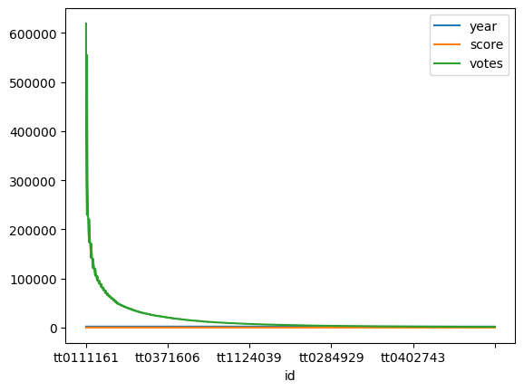
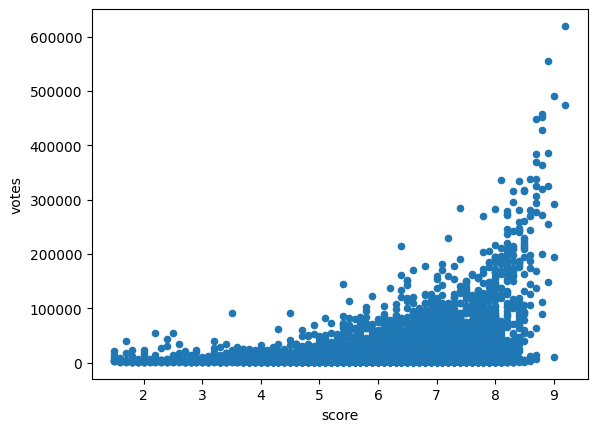
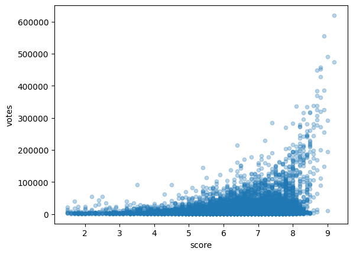
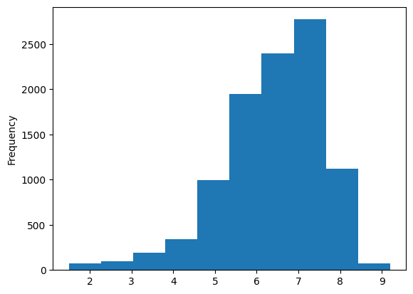
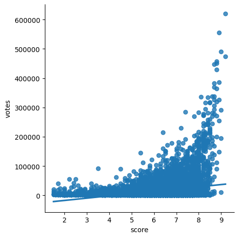
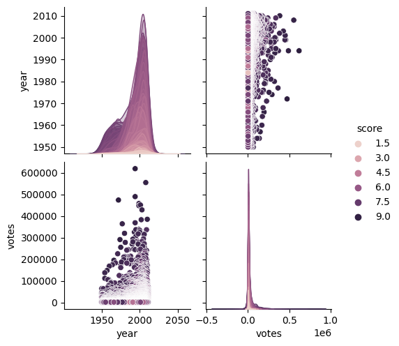
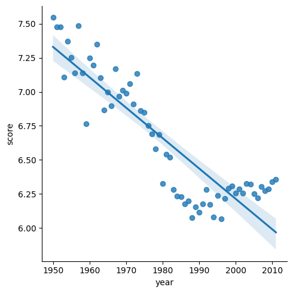
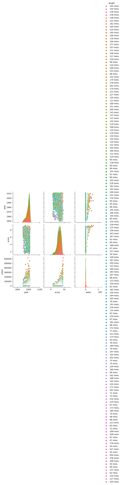

## Import Pandas


```python
import pandas as pd
```

## import the dictionary now


```python
names = ['id', 'title', 'year', 'score', 'votes', 'length', 'genres']
data = pd.read_csv('imdb_top_10000.txt', sep='\t', names=names, index_col=0)
```

## Exploring our data


```python
data.head()
```


<div>
<style scoped>
    .dataframe tbody tr th:only-of-type {
        vertical-align: middle;
    }

    .dataframe tbody tr th {
        vertical-align: top;
    }

    .dataframe thead th {
        text-align: right;
    }
</style>
<table border="1" class="dataframe">
  <thead>
    <tr style="text-align: right;">
      <th></th>
      <th>title</th>
      <th>year</th>
      <th>score</th>
      <th>votes</th>
      <th>length</th>
      <th>genres</th>
    </tr>
    <tr>
      <th>id</th>
      <th></th>
      <th></th>
      <th></th>
      <th></th>
      <th></th>
      <th></th>
    </tr>
  </thead>
  <tbody>
    <tr>
      <th>tt0111161</th>
      <td>The Shawshank Redemption (1994)</td>
      <td>1994</td>
      <td>9.2</td>
      <td>619479</td>
      <td>142 mins.</td>
      <td>Crime|Drama</td>
    </tr>
    <tr>
      <th>tt0110912</th>
      <td>Pulp Fiction (1994)</td>
      <td>1994</td>
      <td>9.0</td>
      <td>490065</td>
      <td>154 mins.</td>
      <td>Crime|Thriller</td>
    </tr>
    <tr>
      <th>tt0137523</th>
      <td>Fight Club (1999)</td>
      <td>1999</td>
      <td>8.8</td>
      <td>458173</td>
      <td>139 mins.</td>
      <td>Drama|Mystery|Thriller</td>
    </tr>
    <tr>
      <th>tt0133093</th>
      <td>The Matrix (1999)</td>
      <td>1999</td>
      <td>8.7</td>
      <td>448114</td>
      <td>136 mins.</td>
      <td>Action|Adventure|Sci-Fi</td>
    </tr>
    <tr>
      <th>tt1375666</th>
      <td>Inception (2010)</td>
      <td>2010</td>
      <td>8.9</td>
      <td>385149</td>
      <td>148 mins.</td>
      <td>Action|Adventure|Sci-Fi|Thriller</td>
    </tr>
  </tbody>
</table>
</div>


```python
data.tail()

```


<div>
<style scoped>
    .dataframe tbody tr th:only-of-type {
        vertical-align: middle;
    }

    .dataframe tbody tr th {
        vertical-align: top;
    }

    .dataframe thead th {
        text-align: right;
    }
</style>
<table border="1" class="dataframe">
  <thead>
    <tr style="text-align: right;">
      <th></th>
      <th>title</th>
      <th>year</th>
      <th>score</th>
      <th>votes</th>
      <th>length</th>
      <th>genres</th>
    </tr>
    <tr>
      <th>id</th>
      <th></th>
      <th></th>
      <th></th>
      <th></th>
      <th></th>
      <th></th>
    </tr>
  </thead>
  <tbody>
    <tr>
      <th>tt0807721</th>
      <td>Meduzot (2007)</td>
      <td>2007</td>
      <td>7.0</td>
      <td>1357</td>
      <td>78 mins.</td>
      <td>Drama</td>
    </tr>
    <tr>
      <th>tt0339642</th>
      <td>Daltry Calhoun (2005)</td>
      <td>2005</td>
      <td>5.2</td>
      <td>1357</td>
      <td>100 mins.</td>
      <td>Comedy|Drama|Music|Romance</td>
    </tr>
    <tr>
      <th>tt0060880</th>
      <td>The Quiller Memorandum (1966)</td>
      <td>1966</td>
      <td>6.5</td>
      <td>1356</td>
      <td>104 mins.</td>
      <td>Drama|Mystery|Thriller</td>
    </tr>
    <tr>
      <th>tt0152836</th>
      <td>Taal (1999)</td>
      <td>1999</td>
      <td>6.5</td>
      <td>1356</td>
      <td>179 mins.</td>
      <td>Musical|Romance</td>
    </tr>
    <tr>
      <th>tt0279977</th>
      <td>The Navigators (2001)</td>
      <td>2001</td>
      <td>6.9</td>
      <td>1356</td>
      <td>96 mins.</td>
      <td>Comedy|Drama</td>
    </tr>
  </tbody>
</table>
</div>


data.info()


```python
data.describe()
```


<div>
<style scoped>
    .dataframe tbody tr th:only-of-type {
        vertical-align: middle;
    }

    .dataframe tbody tr th {
        vertical-align: top;
    }

    .dataframe thead th {
        text-align: right;
    }
</style>
<table border="1" class="dataframe">
  <thead>
    <tr style="text-align: right;">
      <th></th>
      <th>year</th>
      <th>score</th>
      <th>votes</th>
    </tr>
  </thead>
  <tbody>
    <tr>
      <th>count</th>
      <td>10000.000000</td>
      <td>10000.000000</td>
      <td>10000.000000</td>
    </tr>
    <tr>
      <th>mean</th>
      <td>1993.472800</td>
      <td>6.386070</td>
      <td>16604.012800</td>
    </tr>
    <tr>
      <th>std</th>
      <td>14.829924</td>
      <td>1.189933</td>
      <td>34563.459698</td>
    </tr>
    <tr>
      <th>min</th>
      <td>1950.000000</td>
      <td>1.500000</td>
      <td>1356.000000</td>
    </tr>
    <tr>
      <th>25%</th>
      <td>1986.000000</td>
      <td>5.700000</td>
      <td>2333.750000</td>
    </tr>
    <tr>
      <th>50%</th>
      <td>1998.000000</td>
      <td>6.600000</td>
      <td>4980.500000</td>
    </tr>
    <tr>
      <th>75%</th>
      <td>2005.000000</td>
      <td>7.200000</td>
      <td>15277.750000</td>
    </tr>
    <tr>
      <th>max</th>
      <td>2011.000000</td>
      <td>9.200000</td>
      <td>619479.000000</td>
    </tr>
  </tbody>
</table>
</div>


## Exporting data


```python
#data.to_csv('test.csv', header=True, index=True)
```


```python
data.sort_values(by='score', ascending=False)
```


<div>
<style scoped>
    .dataframe tbody tr th:only-of-type {
        vertical-align: middle;
    }

    .dataframe tbody tr th {
        vertical-align: top;
    }

    .dataframe thead th {
        text-align: right;
    }
</style>
<table border="1" class="dataframe">
  <thead>
    <tr style="text-align: right;">
      <th></th>
      <th>title</th>
      <th>year</th>
      <th>score</th>
      <th>votes</th>
      <th>length</th>
      <th>genres</th>
    </tr>
    <tr>
      <th>id</th>
      <th></th>
      <th></th>
      <th></th>
      <th></th>
      <th></th>
      <th></th>
    </tr>
  </thead>
  <tbody>
    <tr>
      <th>tt0111161</th>
      <td>The Shawshank Redemption (1994)</td>
      <td>1994</td>
      <td>9.2</td>
      <td>619479</td>
      <td>142 mins.</td>
      <td>Crime|Drama</td>
    </tr>
    <tr>
      <th>tt0068646</th>
      <td>The Godfather (1972)</td>
      <td>1972</td>
      <td>9.2</td>
      <td>474189</td>
      <td>175 mins.</td>
      <td>Crime|Drama</td>
    </tr>
    <tr>
      <th>tt0060196</th>
      <td>The Good, the Bad and the Ugly (1966)</td>
      <td>1966</td>
      <td>9.0</td>
      <td>195238</td>
      <td>161 mins.</td>
      <td>Western</td>
    </tr>
    <tr>
      <th>tt0110912</th>
      <td>Pulp Fiction (1994)</td>
      <td>1994</td>
      <td>9.0</td>
      <td>490065</td>
      <td>154 mins.</td>
      <td>Crime|Thriller</td>
    </tr>
    <tr>
      <th>tt0252487</th>
      <td>Outrageous Class (1975)</td>
      <td>1975</td>
      <td>9.0</td>
      <td>9823</td>
      <td>87 mins.</td>
      <td>Comedy|Drama</td>
    </tr>
    <tr>
      <th>...</th>
      <td>...</td>
      <td>...</td>
      <td>...</td>
      <td>...</td>
      <td>...</td>
      <td>...</td>
    </tr>
    <tr>
      <th>tt0364986</th>
      <td>Ben &amp; Arthur (2002)</td>
      <td>2002</td>
      <td>1.5</td>
      <td>4675</td>
      <td>85 mins.</td>
      <td>Drama|Romance</td>
    </tr>
    <tr>
      <th>tt0060753</th>
      <td>Night Train to Mundo Fine (1966)</td>
      <td>1966</td>
      <td>1.5</td>
      <td>3542</td>
      <td>89 mins.</td>
      <td>Action|Adventure|Crime|War</td>
    </tr>
    <tr>
      <th>tt0421051</th>
      <td>Daniel the Wizard (2004)</td>
      <td>2004</td>
      <td>1.5</td>
      <td>8271</td>
      <td>81 mins.</td>
      <td>Comedy|Crime|Family|Fantasy|Horror</td>
    </tr>
    <tr>
      <th>tt0059464</th>
      <td>Monster a-Go Go (1965)</td>
      <td>1965</td>
      <td>1.5</td>
      <td>3255</td>
      <td>70 mins.</td>
      <td>Sci-Fi|Horror</td>
    </tr>
    <tr>
      <th>tt0060666</th>
      <td>Manos: The Hands of Fate (1966)</td>
      <td>1966</td>
      <td>1.5</td>
      <td>20927</td>
      <td>74 mins.</td>
      <td>Horror</td>
    </tr>
  </tbody>
</table>
<p>10000 rows × 6 columns</p>
</div>


## Data Frames from scratch


```python
sample_data = {
   'tv': [230.1, 44.5, 17.2],
   'radio': [37.8, 39.3, 45.9],
   'news': [69.2, 45.1, 69.3],
   'sales': [22.1, 10.4, 9.3]
}
```


```python
data2 = pd.DataFrame(sample_data)
```


```python
data2
```


<div>
<style scoped>
    .dataframe tbody tr th:only-of-type {
        vertical-align: middle;
    }

    .dataframe tbody tr th {
        vertical-align: top;
    }

    .dataframe thead th {
        text-align: right;
    }
</style>
<table border="1" class="dataframe">
  <thead>
    <tr style="text-align: right;">
      <th></th>
      <th>tv</th>
      <th>radio</th>
      <th>news</th>
      <th>sales</th>
    </tr>
  </thead>
  <tbody>
    <tr>
      <th>0</th>
      <td>230.1</td>
      <td>37.8</td>
      <td>69.2</td>
      <td>22.1</td>
    </tr>
    <tr>
      <th>1</th>
      <td>44.5</td>
      <td>39.3</td>
      <td>45.1</td>
      <td>10.4</td>
    </tr>
    <tr>
      <th>2</th>
      <td>17.2</td>
      <td>45.9</td>
      <td>69.3</td>
      <td>9.3</td>
    </tr>
  </tbody>
</table>
</div>


## Selecting Data


```python
data['title']
```


    id
    tt0111161    The Shawshank Redemption (1994)
    tt0110912                Pulp Fiction (1994)
    tt0137523                  Fight Club (1999)
    tt0133093                  The Matrix (1999)
    tt1375666                   Inception (2010)
                              ...               
    tt0807721                     Meduzot (2007)
    tt0339642              Daltry Calhoun (2005)
    tt0060880      The Quiller Memorandum (1966)
    tt0152836                        Taal (1999)
    tt0279977              The Navigators (2001)
    Name: title, Length: 10000, dtype: object


```python
data[['title','year']]
```


<div>
<style scoped>
    .dataframe tbody tr th:only-of-type {
        vertical-align: middle;
    }

    .dataframe tbody tr th {
        vertical-align: top;
    }

    .dataframe thead th {
        text-align: right;
    }
</style>
<table border="1" class="dataframe">
  <thead>
    <tr style="text-align: right;">
      <th></th>
      <th>title</th>
      <th>year</th>
    </tr>
    <tr>
      <th>id</th>
      <th></th>
      <th></th>
    </tr>
  </thead>
  <tbody>
    <tr>
      <th>tt0111161</th>
      <td>The Shawshank Redemption (1994)</td>
      <td>1994</td>
    </tr>
    <tr>
      <th>tt0110912</th>
      <td>Pulp Fiction (1994)</td>
      <td>1994</td>
    </tr>
    <tr>
      <th>tt0137523</th>
      <td>Fight Club (1999)</td>
      <td>1999</td>
    </tr>
    <tr>
      <th>tt0133093</th>
      <td>The Matrix (1999)</td>
      <td>1999</td>
    </tr>
    <tr>
      <th>tt1375666</th>
      <td>Inception (2010)</td>
      <td>2010</td>
    </tr>
    <tr>
      <th>...</th>
      <td>...</td>
      <td>...</td>
    </tr>
    <tr>
      <th>tt0807721</th>
      <td>Meduzot (2007)</td>
      <td>2007</td>
    </tr>
    <tr>
      <th>tt0339642</th>
      <td>Daltry Calhoun (2005)</td>
      <td>2005</td>
    </tr>
    <tr>
      <th>tt0060880</th>
      <td>The Quiller Memorandum (1966)</td>
      <td>1966</td>
    </tr>
    <tr>
      <th>tt0152836</th>
      <td>Taal (1999)</td>
      <td>1999</td>
    </tr>
    <tr>
      <th>tt0279977</th>
      <td>The Navigators (2001)</td>
      <td>2001</td>
    </tr>
  </tbody>
</table>
<p>10000 rows × 2 columns</p>
</div>


```python
data['score'].mean()
```


    6.38607


```python
data['score'].max()
```


    9.2


```python
data['score'].min()
```


    1.5


```python
data['genres'].unique()
```


    array(['Crime|Drama', 'Crime|Thriller', 'Drama|Mystery|Thriller', ...,
           'Drama|War|Adventure|Romance', 'Western|Sci-Fi|Thriller',
           'Adventure|Comedy|Drama|War'], dtype=object)


```python
data['score'].value_counts()
```


    7.1    401
    6.8    401
    7.2    386
    6.7    384
    7.0    382
          ... 
    1.5      7
    1.6      6
    8.9      5
    9.0      4
    9.2      2
    Name: score, Length: 77, dtype: int64


```python
data['score'].value_counts().sort_index()
```


    1.5     7
    1.6     6
    1.7    12
    1.8    12
    1.9     9
           ..
    8.7    13
    8.8     9
    8.9     5
    9.0     4
    9.2     2
    Name: score, Length: 77, dtype: int64


```python
data['score'].value_counts().sort_index(ascending=False)
```


    9.2     2
    9.0     4
    8.9     5
    8.8     9
    8.7    13
           ..
    1.9     9
    1.8    12
    1.7    12
    1.6     6
    1.5     7
    Name: score, Length: 77, dtype: int64


```python
%matplotlib inline
```


```python
data.plot()
```


    <AxesSubplot: xlabel='id'>


    

    


```python
data.plot(kind='scatter', x='score', y='votes')
```


    <AxesSubplot: xlabel='score', ylabel='votes'>


    

    


```python
data.plot(kind='scatter', x='score', y='votes', alpha=0.3)
```


    <AxesSubplot: xlabel='score', ylabel='votes'>


    

    


```python
data['score'].plot(kind='hist')
```


    <AxesSubplot: ylabel='Frequency'>


    

    


```python
import seaborn as sns
```


```python
sns.lmplot(x='score', y='votes', data=data)
```


    <seaborn.axisgrid.FacetGrid at 0x106158a90>


    

    


```python
data3 = pd.DataFrame(data)
sns.pairplot(data, hue='score', height=2.5)
```


    <seaborn.axisgrid.PairGrid at 0x146ad5ff0>


    

    


## Ordinary least squares regression (OLS)


```python
import statsmodels.api as sm

```


```python
results = sm.OLS(data['score'], data['votes']).fit()
```


```python
results.summary()
```


<table class="simpletable">
<caption>OLS Regression Results</caption>
<tr>
  <th>Dep. Variable:</th>          <td>score</td>      <th>  R-squared (uncentered):</th>      <td>   0.221</td> 
</tr>
<tr>
  <th>Model:</th>                   <td>OLS</td>       <th>  Adj. R-squared (uncentered):</th> <td>   0.220</td> 
</tr>
<tr>
  <th>Method:</th>             <td>Least Squares</td>  <th>  F-statistic:       </th>          <td>   2829.</td> 
</tr>
<tr>
  <th>Date:</th>             <td>Fri, 28 Oct 2022</td> <th>  Prob (F-statistic):</th>           <td>  0.00</td>  
</tr>
<tr>
  <th>Time:</th>                 <td>12:48:14</td>     <th>  Log-Likelihood:    </th>          <td> -31655.</td> 
</tr>
<tr>
  <th>No. Observations:</th>      <td> 10000</td>      <th>  AIC:               </th>          <td>6.331e+04</td>
</tr>
<tr>
  <th>Df Residuals:</th>          <td>  9999</td>      <th>  BIC:               </th>          <td>6.332e+04</td>
</tr>
<tr>
  <th>Df Model:</th>              <td>     1</td>      <th>                     </th>              <td> </td>    
</tr>
<tr>
  <th>Covariance Type:</th>      <td>nonrobust</td>    <th>                     </th>              <td> </td>    
</tr>
</table>
<table class="simpletable">
<tr>
    <td></td>       <th>coef</th>     <th>std err</th>      <th>t</th>      <th>P>|t|</th>  <th>[0.025</th>    <th>0.975]</th>  
</tr>
<tr>
  <th>votes</th> <td> 7.956e-05</td> <td>  1.5e-06</td> <td>   53.190</td> <td> 0.000</td> <td> 7.66e-05</td> <td> 8.25e-05</td>
</tr>
</table>
<table class="simpletable">
<tr>
  <th>Omnibus:</th>       <td>9919.237</td> <th>  Durbin-Watson:     </th>  <td>   0.082</td> 
</tr>
<tr>
  <th>Prob(Omnibus):</th>  <td> 0.000</td>  <th>  Jarque-Bera (JB):  </th> <td>762189.305</td>
</tr>
<tr>
  <th>Skew:</th>           <td>-4.757</td>  <th>  Prob(JB):          </th>  <td>    0.00</td> 
</tr>
<tr>
  <th>Kurtosis:</th>       <td>44.698</td>  <th>  Cond. No.          </th>  <td>    1.00</td> 
</tr>
</table><br/><br/>Notes:<br/>[1] R² is computed without centering (uncentered) since the model does not contain a constant.<br/>[2] Standard Errors assume that the covariance matrix of the errors is correctly specified.


## Advanced data selection


```python
data[data['year'] > 1995]
```


<div>
<style scoped>
    .dataframe tbody tr th:only-of-type {
        vertical-align: middle;
    }

    .dataframe tbody tr th {
        vertical-align: top;
    }

    .dataframe thead th {
        text-align: right;
    }
</style>
<table border="1" class="dataframe">
  <thead>
    <tr style="text-align: right;">
      <th></th>
      <th>title</th>
      <th>year</th>
      <th>score</th>
      <th>votes</th>
      <th>length</th>
      <th>genres</th>
    </tr>
    <tr>
      <th>id</th>
      <th></th>
      <th></th>
      <th></th>
      <th></th>
      <th></th>
      <th></th>
    </tr>
  </thead>
  <tbody>
    <tr>
      <th>tt0137523</th>
      <td>Fight Club (1999)</td>
      <td>1999</td>
      <td>8.8</td>
      <td>458173</td>
      <td>139 mins.</td>
      <td>Drama|Mystery|Thriller</td>
    </tr>
    <tr>
      <th>tt0133093</th>
      <td>The Matrix (1999)</td>
      <td>1999</td>
      <td>8.7</td>
      <td>448114</td>
      <td>136 mins.</td>
      <td>Action|Adventure|Sci-Fi</td>
    </tr>
    <tr>
      <th>tt1375666</th>
      <td>Inception (2010)</td>
      <td>2010</td>
      <td>8.9</td>
      <td>385149</td>
      <td>148 mins.</td>
      <td>Action|Adventure|Sci-Fi|Thriller</td>
    </tr>
    <tr>
      <th>tt0169547</th>
      <td>American Beauty (1999)</td>
      <td>1999</td>
      <td>8.6</td>
      <td>338332</td>
      <td>122 mins.</td>
      <td>Drama</td>
    </tr>
    <tr>
      <th>tt0499549</th>
      <td>Avatar (2009)</td>
      <td>2009</td>
      <td>8.1</td>
      <td>336855</td>
      <td>162 mins.</td>
      <td>Action|Adventure|Fantasy|Sci-Fi</td>
    </tr>
    <tr>
      <th>...</th>
      <td>...</td>
      <td>...</td>
      <td>...</td>
      <td>...</td>
      <td>...</td>
      <td>...</td>
    </tr>
    <tr>
      <th>tt0118635</th>
      <td>Aprile (1998)</td>
      <td>1998</td>
      <td>6.7</td>
      <td>1358</td>
      <td>78 mins.</td>
      <td>Comedy</td>
    </tr>
    <tr>
      <th>tt0807721</th>
      <td>Meduzot (2007)</td>
      <td>2007</td>
      <td>7.0</td>
      <td>1357</td>
      <td>78 mins.</td>
      <td>Drama</td>
    </tr>
    <tr>
      <th>tt0339642</th>
      <td>Daltry Calhoun (2005)</td>
      <td>2005</td>
      <td>5.2</td>
      <td>1357</td>
      <td>100 mins.</td>
      <td>Comedy|Drama|Music|Romance</td>
    </tr>
    <tr>
      <th>tt0152836</th>
      <td>Taal (1999)</td>
      <td>1999</td>
      <td>6.5</td>
      <td>1356</td>
      <td>179 mins.</td>
      <td>Musical|Romance</td>
    </tr>
    <tr>
      <th>tt0279977</th>
      <td>The Navigators (2001)</td>
      <td>2001</td>
      <td>6.9</td>
      <td>1356</td>
      <td>96 mins.</td>
      <td>Comedy|Drama</td>
    </tr>
  </tbody>
</table>
<p>5710 rows × 6 columns</p>
</div>


```python
data[(data['year'] > 1995) & (data['year'] < 1997)].sort_values('score', ascending=False)
```


<div>
<style scoped>
    .dataframe tbody tr th:only-of-type {
        vertical-align: middle;
    }

    .dataframe tbody tr th {
        vertical-align: top;
    }

    .dataframe thead th {
        text-align: right;
    }
</style>
<table border="1" class="dataframe">
  <thead>
    <tr style="text-align: right;">
      <th></th>
      <th>title</th>
      <th>year</th>
      <th>score</th>
      <th>votes</th>
      <th>length</th>
      <th>genres</th>
    </tr>
    <tr>
      <th>id</th>
      <th></th>
      <th></th>
      <th></th>
      <th></th>
      <th></th>
      <th></th>
    </tr>
  </thead>
  <tbody>
    <tr>
      <th>tt0116282</th>
      <td>Fargo (1996)</td>
      <td>1996</td>
      <td>8.3</td>
      <td>187498</td>
      <td>98 mins.</td>
      <td>Crime|Drama|Thriller</td>
    </tr>
    <tr>
      <th>tt0116231</th>
      <td>The Bandit (1996)</td>
      <td>1996</td>
      <td>8.3</td>
      <td>13288</td>
      <td>121 mins.</td>
      <td>Action|Crime|Drama|Romance|Thriller</td>
    </tr>
    <tr>
      <th>tt0117951</th>
      <td>Trainspotting (1996)</td>
      <td>1996</td>
      <td>8.2</td>
      <td>175993</td>
      <td>94 mins.</td>
      <td>Crime|Drama</td>
    </tr>
    <tr>
      <th>tt0117666</th>
      <td>Sling Blade (1996)</td>
      <td>1996</td>
      <td>8.0</td>
      <td>44316</td>
      <td>135 mins.</td>
      <td>Drama</td>
    </tr>
    <tr>
      <th>tt0117589</th>
      <td>Secrets &amp; Lies (1996)</td>
      <td>1996</td>
      <td>8.0</td>
      <td>15435</td>
      <td>142 mins.</td>
      <td>Comedy|Drama</td>
    </tr>
    <tr>
      <th>...</th>
      <td>...</td>
      <td>...</td>
      <td>...</td>
      <td>...</td>
      <td>...</td>
      <td>...</td>
    </tr>
    <tr>
      <th>tt0116165</th>
      <td>Ed (1996)</td>
      <td>1996</td>
      <td>2.4</td>
      <td>4085</td>
      <td>94 mins.</td>
      <td>Comedy|Family|Sport</td>
    </tr>
    <tr>
      <th>tt0116839</th>
      <td>Lawnmower Man 2: Beyond Cyberspace (1996)</td>
      <td>1996</td>
      <td>2.2</td>
      <td>5299</td>
      <td>92 mins.</td>
      <td>Action|Sci-Fi|Thriller</td>
    </tr>
    <tr>
      <th>tt0117676</th>
      <td>Snowboard Academy (1996)</td>
      <td>1996</td>
      <td>2.2</td>
      <td>1776</td>
      <td>88 mins.</td>
      <td>Comedy|Sport</td>
    </tr>
    <tr>
      <th>tt0117550</th>
      <td>Santa with Muscles (1996)</td>
      <td>1996</td>
      <td>2.1</td>
      <td>6420</td>
      <td>97 mins.</td>
      <td>Family|Comedy</td>
    </tr>
    <tr>
      <th>tt0174917</th>
      <td>Merlin's Shop of Mystical Wonders (1996)</td>
      <td>1996</td>
      <td>1.7</td>
      <td>2362</td>
      <td>92 mins.</td>
      <td>Fantasy|Horror</td>
    </tr>
  </tbody>
</table>
<p>265 rows × 6 columns</p>
</div>


## Average rating of movies by year


```python
yearlyData = data.groupby(data['year'])['score'].mean().reset_index()
```


```python
sns.lmplot(x='year', y='score', data=yearlyData)
```


    <seaborn.axisgrid.FacetGrid at 0x28e748910>


    

    


## Challenge Questions: 
- What was the highest scoring movie in 1996?
- `data[data['year'] == 1996].sort_values(by='rating', ascending=False).head()`

- In what year was the highest rated movie of all time made?
- `data[data['rating'] == data['rating'].max()]​`

- What five movies have the most votes ever?
- `data.sort_values(by='votes', ascending=False).head()​`

- What year in the 1960s had the highest average movie rating?
- `data[(data['year'] >= 1960) & (data['year'] <= 1970)].groupby(data['year'])['rating'].mean()​`


```python
data[(data['year'] == 1996)].sort_values('score', ascending=False).head()
```


<div>
<style scoped>
    .dataframe tbody tr th:only-of-type {
        vertical-align: middle;
    }

    .dataframe tbody tr th {
        vertical-align: top;
    }

    .dataframe thead th {
        text-align: right;
    }
</style>
<table border="1" class="dataframe">
  <thead>
    <tr style="text-align: right;">
      <th></th>
      <th>title</th>
      <th>year</th>
      <th>score</th>
      <th>votes</th>
      <th>length</th>
      <th>genres</th>
    </tr>
    <tr>
      <th>id</th>
      <th></th>
      <th></th>
      <th></th>
      <th></th>
      <th></th>
      <th></th>
    </tr>
  </thead>
  <tbody>
    <tr>
      <th>tt0116282</th>
      <td>Fargo (1996)</td>
      <td>1996</td>
      <td>8.3</td>
      <td>187498</td>
      <td>98 mins.</td>
      <td>Crime|Drama|Thriller</td>
    </tr>
    <tr>
      <th>tt0116231</th>
      <td>The Bandit (1996)</td>
      <td>1996</td>
      <td>8.3</td>
      <td>13288</td>
      <td>121 mins.</td>
      <td>Action|Crime|Drama|Romance|Thriller</td>
    </tr>
    <tr>
      <th>tt0117951</th>
      <td>Trainspotting (1996)</td>
      <td>1996</td>
      <td>8.2</td>
      <td>175993</td>
      <td>94 mins.</td>
      <td>Crime|Drama</td>
    </tr>
    <tr>
      <th>tt0117666</th>
      <td>Sling Blade (1996)</td>
      <td>1996</td>
      <td>8.0</td>
      <td>44316</td>
      <td>135 mins.</td>
      <td>Drama</td>
    </tr>
    <tr>
      <th>tt0117589</th>
      <td>Secrets &amp; Lies (1996)</td>
      <td>1996</td>
      <td>8.0</td>
      <td>15435</td>
      <td>142 mins.</td>
      <td>Comedy|Drama</td>
    </tr>
  </tbody>
</table>
</div>


```python
data.sort_values('score', ascending=False).head()
```


<div>
<style scoped>
    .dataframe tbody tr th:only-of-type {
        vertical-align: middle;
    }

    .dataframe tbody tr th {
        vertical-align: top;
    }

    .dataframe thead th {
        text-align: right;
    }
</style>
<table border="1" class="dataframe">
  <thead>
    <tr style="text-align: right;">
      <th></th>
      <th>title</th>
      <th>year</th>
      <th>score</th>
      <th>votes</th>
      <th>length</th>
      <th>genres</th>
    </tr>
    <tr>
      <th>id</th>
      <th></th>
      <th></th>
      <th></th>
      <th></th>
      <th></th>
      <th></th>
    </tr>
  </thead>
  <tbody>
    <tr>
      <th>tt0111161</th>
      <td>The Shawshank Redemption (1994)</td>
      <td>1994</td>
      <td>9.2</td>
      <td>619479</td>
      <td>142 mins.</td>
      <td>Crime|Drama</td>
    </tr>
    <tr>
      <th>tt0068646</th>
      <td>The Godfather (1972)</td>
      <td>1972</td>
      <td>9.2</td>
      <td>474189</td>
      <td>175 mins.</td>
      <td>Crime|Drama</td>
    </tr>
    <tr>
      <th>tt0060196</th>
      <td>The Good, the Bad and the Ugly (1966)</td>
      <td>1966</td>
      <td>9.0</td>
      <td>195238</td>
      <td>161 mins.</td>
      <td>Western</td>
    </tr>
    <tr>
      <th>tt0110912</th>
      <td>Pulp Fiction (1994)</td>
      <td>1994</td>
      <td>9.0</td>
      <td>490065</td>
      <td>154 mins.</td>
      <td>Crime|Thriller</td>
    </tr>
    <tr>
      <th>tt0252487</th>
      <td>Outrageous Class (1975)</td>
      <td>1975</td>
      <td>9.0</td>
      <td>9823</td>
      <td>87 mins.</td>
      <td>Comedy|Drama</td>
    </tr>
  </tbody>
</table>
</div>


```python
data.sort_values('votes', ascending=False).head()
```


<div>
<style scoped>
    .dataframe tbody tr th:only-of-type {
        vertical-align: middle;
    }

    .dataframe tbody tr th {
        vertical-align: top;
    }

    .dataframe thead th {
        text-align: right;
    }
</style>
<table border="1" class="dataframe">
  <thead>
    <tr style="text-align: right;">
      <th></th>
      <th>title</th>
      <th>year</th>
      <th>score</th>
      <th>votes</th>
      <th>length</th>
      <th>genres</th>
    </tr>
    <tr>
      <th>id</th>
      <th></th>
      <th></th>
      <th></th>
      <th></th>
      <th></th>
      <th></th>
    </tr>
  </thead>
  <tbody>
    <tr>
      <th>tt0111161</th>
      <td>The Shawshank Redemption (1994)</td>
      <td>1994</td>
      <td>9.2</td>
      <td>619479</td>
      <td>142 mins.</td>
      <td>Crime|Drama</td>
    </tr>
    <tr>
      <th>tt0468569</th>
      <td>The Dark Knight (2008)</td>
      <td>2008</td>
      <td>8.9</td>
      <td>555122</td>
      <td>152 mins.</td>
      <td>Action|Crime|Drama|Thriller</td>
    </tr>
    <tr>
      <th>tt0110912</th>
      <td>Pulp Fiction (1994)</td>
      <td>1994</td>
      <td>9.0</td>
      <td>490065</td>
      <td>154 mins.</td>
      <td>Crime|Thriller</td>
    </tr>
    <tr>
      <th>tt0068646</th>
      <td>The Godfather (1972)</td>
      <td>1972</td>
      <td>9.2</td>
      <td>474189</td>
      <td>175 mins.</td>
      <td>Crime|Drama</td>
    </tr>
    <tr>
      <th>tt0137523</th>
      <td>Fight Club (1999)</td>
      <td>1999</td>
      <td>8.8</td>
      <td>458173</td>
      <td>139 mins.</td>
      <td>Drama|Mystery|Thriller</td>
    </tr>
  </tbody>
</table>
</div>


```python
data[(data['year'] >= 1960) & (data['year'] <= 1970)].sort_values('score', ascending=False).head()
```


<div>
<style scoped>
    .dataframe tbody tr th:only-of-type {
        vertical-align: middle;
    }

    .dataframe tbody tr th {
        vertical-align: top;
    }

    .dataframe thead th {
        text-align: right;
    }
</style>
<table border="1" class="dataframe">
  <thead>
    <tr style="text-align: right;">
      <th></th>
      <th>title</th>
      <th>year</th>
      <th>score</th>
      <th>votes</th>
      <th>length</th>
      <th>genres</th>
    </tr>
    <tr>
      <th>id</th>
      <th></th>
      <th></th>
      <th></th>
      <th></th>
      <th></th>
      <th></th>
    </tr>
  </thead>
  <tbody>
    <tr>
      <th>tt0060196</th>
      <td>The Good, the Bad and the Ugly (1966)</td>
      <td>1966</td>
      <td>9.0</td>
      <td>195238</td>
      <td>161 mins.</td>
      <td>Western</td>
    </tr>
    <tr>
      <th>tt0064116</th>
      <td>Once Upon a Time in the West (1968)</td>
      <td>1968</td>
      <td>8.8</td>
      <td>89764</td>
      <td>175 mins.</td>
      <td>Western</td>
    </tr>
    <tr>
      <th>tt0054215</th>
      <td>Psycho (1960)</td>
      <td>1960</td>
      <td>8.7</td>
      <td>168286</td>
      <td>109 mins.</td>
      <td>Horror|Mystery|Thriller</td>
    </tr>
    <tr>
      <th>tt0057012</th>
      <td>Dr. Strangelove or: How I Learned to Stop Worr...</td>
      <td>1964</td>
      <td>8.6</td>
      <td>174723</td>
      <td>95 mins.</td>
      <td>Comedy|Drama</td>
    </tr>
    <tr>
      <th>tt0056592</th>
      <td>To Kill a Mockingbird (1962)</td>
      <td>1962</td>
      <td>8.5</td>
      <td>93918</td>
      <td>129 mins.</td>
      <td>Crime|Drama|Mystery</td>
    </tr>
  </tbody>
</table>
</div>


## Cleaning Data


```python
data['formatted title'] = data['title'].str[:-7] 
```


```python
data['parsed length'] = data['length'].str[:-6]
```


```python
data
```


<div>
<style scoped>
    .dataframe tbody tr th:only-of-type {
        vertical-align: middle;
    }

    .dataframe tbody tr th {
        vertical-align: top;
    }

    .dataframe thead th {
        text-align: right;
    }
</style>
<table border="1" class="dataframe">
  <thead>
    <tr style="text-align: right;">
      <th></th>
      <th>title</th>
      <th>year</th>
      <th>score</th>
      <th>votes</th>
      <th>length</th>
      <th>genres</th>
      <th>formatted title</th>
      <th>parsed length</th>
    </tr>
    <tr>
      <th>id</th>
      <th></th>
      <th></th>
      <th></th>
      <th></th>
      <th></th>
      <th></th>
      <th></th>
      <th></th>
    </tr>
  </thead>
  <tbody>
    <tr>
      <th>tt0111161</th>
      <td>The Shawshank Redemption (1994)</td>
      <td>1994</td>
      <td>9.2</td>
      <td>619479</td>
      <td>142 mins.</td>
      <td>Crime|Drama</td>
      <td>The Shawshank Redemption</td>
      <td>142</td>
    </tr>
    <tr>
      <th>tt0110912</th>
      <td>Pulp Fiction (1994)</td>
      <td>1994</td>
      <td>9.0</td>
      <td>490065</td>
      <td>154 mins.</td>
      <td>Crime|Thriller</td>
      <td>Pulp Fiction</td>
      <td>154</td>
    </tr>
    <tr>
      <th>tt0137523</th>
      <td>Fight Club (1999)</td>
      <td>1999</td>
      <td>8.8</td>
      <td>458173</td>
      <td>139 mins.</td>
      <td>Drama|Mystery|Thriller</td>
      <td>Fight Club</td>
      <td>139</td>
    </tr>
    <tr>
      <th>tt0133093</th>
      <td>The Matrix (1999)</td>
      <td>1999</td>
      <td>8.7</td>
      <td>448114</td>
      <td>136 mins.</td>
      <td>Action|Adventure|Sci-Fi</td>
      <td>The Matrix</td>
      <td>136</td>
    </tr>
    <tr>
      <th>tt1375666</th>
      <td>Inception (2010)</td>
      <td>2010</td>
      <td>8.9</td>
      <td>385149</td>
      <td>148 mins.</td>
      <td>Action|Adventure|Sci-Fi|Thriller</td>
      <td>Inception</td>
      <td>148</td>
    </tr>
    <tr>
      <th>...</th>
      <td>...</td>
      <td>...</td>
      <td>...</td>
      <td>...</td>
      <td>...</td>
      <td>...</td>
      <td>...</td>
      <td>...</td>
    </tr>
    <tr>
      <th>tt0807721</th>
      <td>Meduzot (2007)</td>
      <td>2007</td>
      <td>7.0</td>
      <td>1357</td>
      <td>78 mins.</td>
      <td>Drama</td>
      <td>Meduzot</td>
      <td>78</td>
    </tr>
    <tr>
      <th>tt0339642</th>
      <td>Daltry Calhoun (2005)</td>
      <td>2005</td>
      <td>5.2</td>
      <td>1357</td>
      <td>100 mins.</td>
      <td>Comedy|Drama|Music|Romance</td>
      <td>Daltry Calhoun</td>
      <td>100</td>
    </tr>
    <tr>
      <th>tt0060880</th>
      <td>The Quiller Memorandum (1966)</td>
      <td>1966</td>
      <td>6.5</td>
      <td>1356</td>
      <td>104 mins.</td>
      <td>Drama|Mystery|Thriller</td>
      <td>The Quiller Memorandum</td>
      <td>104</td>
    </tr>
    <tr>
      <th>tt0152836</th>
      <td>Taal (1999)</td>
      <td>1999</td>
      <td>6.5</td>
      <td>1356</td>
      <td>179 mins.</td>
      <td>Musical|Romance</td>
      <td>Taal</td>
      <td>179</td>
    </tr>
    <tr>
      <th>tt0279977</th>
      <td>The Navigators (2001)</td>
      <td>2001</td>
      <td>6.9</td>
      <td>1356</td>
      <td>96 mins.</td>
      <td>Comedy|Drama</td>
      <td>The Navigators</td>
      <td>96</td>
    </tr>
  </tbody>
</table>
<p>10000 rows × 8 columns</p>
</div>


```python
sns.pairplot(data, hue='length', height=2.5)
```


    <seaborn.axisgrid.PairGrid at 0x147160610>


    

    


```python

```
